# Lab#5. Cluster Lab

## 0. Objective

쿠버네티스는 도커에 의해 컨테이너화(containerized)된 애플리케이션에 대한 배포, 스케일링, 그리고 관리를 자동화할 수 있습니다. 이를 컨테이너 오케스트레이터(container orchestrator)라고 합니다.

이번 Lab#5 Cluster에서, 우리는 3개의 NUC machine을 결합해 쿠버네티스 클러스터를 구축하고, 간단한 애플리케이션을 통해 Container Orchestration이란 무엇인지 알아보겠습니다.

총 3개의 NUC machine은 아래의 역할로써 쿠버네티스 클러스터를 구성하게 됩니다.

- 1개의 Master -> NUC1
- 2개의 Workers -> NUC2, NUC3

#### Master-Worker 구조란?

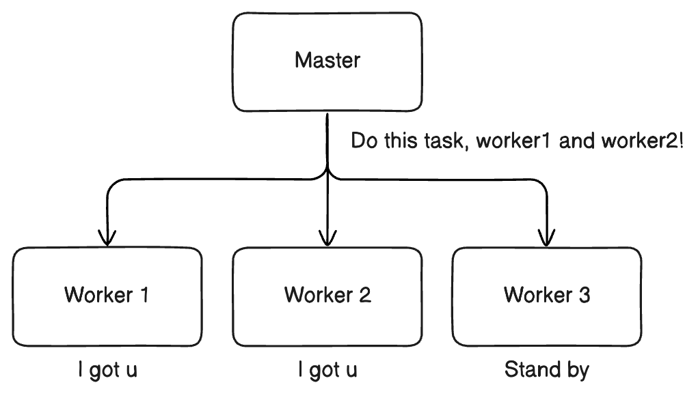

Master-Worker 패턴은 하나의 **Master**가 전체 작업을 여러 개의 작은 단위로 나누어 **여러 Worker**에게 분배하고, 각 Worker가 독립적으로 작업을 수행한 후 결과를 Master에게 반환하는 소프트웨어 아키텍처 패턴입니다. 이 패턴은 병렬 처리를 통해 성능을 극대화하고, Worker를 동적으로 추가하거나 제거할 수 있어 확장성이 뛰어납니다. 또한, 특정 Worker가 작업에 실패하거나 노드(서버, 머신)가 다운되더라도 Master가 이를 감지하고 다른 Worker에게 작업을 재할당할 수 있어 애플리케이션의 안정적인 운영이 가능합니다. 이러한 특성 때문에 쿠버네티스의 클러스터 관리, Hadoop과 Spark의 분산 데이터 처리, Ray의 병렬 컴퓨팅, 멀티스레딩 기반의 애플리케이션 등에서 널리 사용됩니다.

## 1. Concept

### 1-1. Docker Containers


<b>도커(Docker)</b>는 컨테이너 기술을 활용하여 애플리케이션을 보다 쉽게 개발, 배포, 실행할 수 있도록 도와주는 오픈소스 플랫폼입니다. 도커를 사용하면 애플리케이션과 해당 애플리케이션이 의존하는 라이브러리, 실행 환경을 하나의 단위(컨테이너)로 패키징하여 운영체제(OS) 환경에 독립적인 배포가 가능합니다.

#### 도커와 가상 머신(VM)의 차이

도커는 기존의 가상 머신(Virtual Machine)과 비교하여 더 가볍고 빠른 실행 환경을 제공하고, 효율적인 자원 사용을 가능케 합니다.

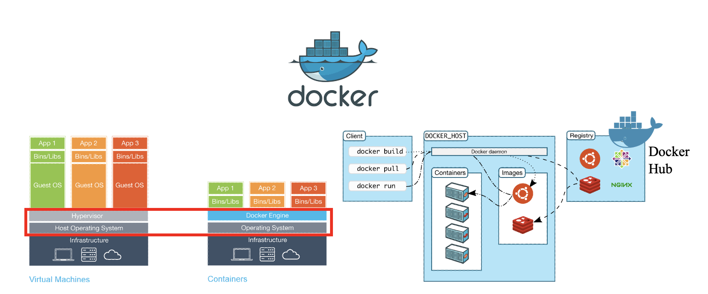

#### 사진 좌측

- 가상 머신(VM): 하이퍼바이저(Hypervisor)를 사용하여 여러 개의 운영체제(Guest OS)를 실행하며, 각 OS가 별도의 자원을 사용하기 때문에 무겁고 부팅 속도가 느립니다.
- 도커 컨테이너: 하나의 운영체제(OS) 커널을 공유하면서도 컨테이너별로 독립된 환경에서 실행됩니다. 컨테이너는 필요한 애플리케이션과 라이브러리만 포함하도록 경량화되었으며, 유연하고 빠른 실행과 배포가 가능합니다.

#### 사진 우측

도커는 클라이언트(Client)-서버(Server) 아키텍쳐를 기반으로 동작하며, 다음으로 구성되어 있습니다.

1. 개발자(docker client)가 도커 명령어 실행

   - `docker build`, `docker pull`, `docker run` 등의 명령어를 통해 도커 활용

2. Docker Daemon (서버) 처리

   - 컨테이너와 도커 이미지 등을 생성하고 관리
   - 개발자가 입력한 명령어를 실질적으로 실행하는 역할

3. Image Registry (이미지 저장소)

   - 애플리케이션의 컨테이너 이미지는 `Docker Hub`와 같은 원격 저장소에서 관리됩니다.
   - AWS ECR과 같은 클라우드형 이미지 Registry나 사설 Registry를 사용할 수도 있습니다.

### 1-2. 컨테이너 오케스트레이션(Container Orchestration)

컨테이너 기술이 널리 사용되면서 여러 개의 컨테이너를 자동으로 배포,관리, 스케일링(확장)하는 방법이 필요해졌습니다. 컨테이너 오케스트레이션은 이러한 문제를 해결하기 위해 등장했습니다.

#### 왜 Container Orchestration이 필요한가?

1. **컨테이너 개수 증가**
   - 단일 서버에서 몇 개의 Container를 실행하고 관리하는 것은 어렵지 않지만, 대규모 애플리케이션에서는 **수백~수천 개**의 컨테이너를 사용하기 때문에 관리가 쉽지 않음.
2. **자동화 및 관리 효율성**
   - 컨테이너의 배포, 네트워크 설정, 로드 밸런싱, 모니터링, 장애 발생 시 자동 복구 등의 기능이 필요함.
3. **고가용성 & 확장성 보장**
   - 특정 컨테이너가 다운되면 자동으로 재시작하거나, 트래픽 증가 시 컨테이너 개수를 자동으로 늘릴 수 있어야 함.

대표적으로 다음과 같은 기능을 제공합니다.

1. **자동화된 배포 및 업데이트**

   - 컨테이너를 자동으로 배포하고, 새로운 버전이 나오면 점진적으로 업데이트 진행 (Rolling Update)

2. **로드 밸런싱 & 서비스 디스커버리**

   - 트래픽을 여러 컨테이너로 분산하여 부하를 최소화하고, 컨테이너 간 통신을 자동으로 설정

3. **자동 복구(Self-healing)**

   - 장애가 발생한 컨테이너를 자동으로 감지하고, 새로운 컨테이너로 대체하여 서비스 중단 방지

4. **클러스터 리소스 최적화**

   - 컨테이너가 클러스터의 CPU, 메모리 등을 효율적으로 활용할 수 있도록 스케줄링

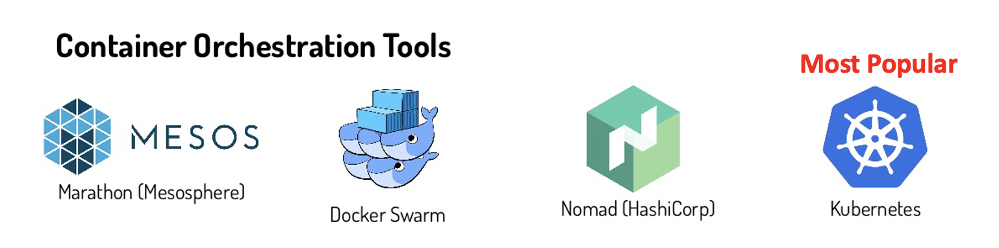

위 사진은 대표적인 컨테이터 오케스트레이션 도구입니다. 현재는 <b>Kubernetes(K8s)</b>가 가장 널리 사용되고 있습니다. (맨 앞(K)과 뒤(s), 그리고 나머지 알파벳의 개수 '8'을 사용하여 K8s라고도 부릅니다.)

### 1-3. 쿠버네티스(Kubernetes)

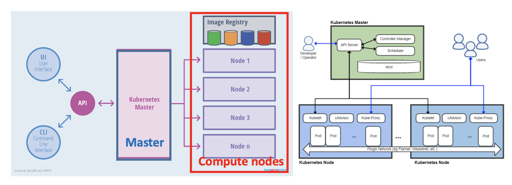

[**Kubernetes**](https://kubernetes.io/)는 컨테이너화된 애플리케이션의 배포, 스케일링, 관리를 자동화하는 **오픈소스 오케스트레이션 시스템**입니다.

#### 1-3-1. **Kubernetes 주요 기능**

- **수평 확장(Horizontal Scaling)**: 간단한 명령어, UI 또는 CPU 샤용량을 기반으로 한 자동화(Auto-scaling)의 방식으로 애플리케이션의 규모를 확장(Scaling)할 수 있습니다.
- **자가 복구(Self-healing)**: 문제가 생긴 컨테이너를 재시작하거나, 문제가 생긴 노드(서버, 머신)에서 실행되고 있는 컨테이너들을 다른 노드의 컨테이너로 교체 혹은 재할당할 수 있으며, 사전 정의된 Health check에 응답하지 않는 컨테이너를 Kill할 수 있습니다. 문제가 해결되기 전까지는 문제가 생긴 노드(혹은 컨테이너)는 Clients에게 노출되지 않습니다.
- **서비스 검색 및 로드 밸런싱(Service Discovery & Load Balancing)**: 각 컨테이너에 고유한 IP를 부여하고, 클러스터 DNS 기반 서비스 검색을 할 수 있는 Service Discovery 기능을 제공합니다. 또한 Load Balancing을 사용해 여러 컨테이너에 트래픽을 분산할 수 있습니다.
- **스토리지 오케스트레이션(Storage Orchestration)**: 로컬 스토리지, 퍼블릭 클라우드 스토리지(NFS, Ceph, AWS EBS, GCP Persistent Disk 등) 등의 다양한 스토리지를 손쉽게 컨테이너에 마운트(Mount)하여 사용할 수 있습니다.

쿠버네티스는 현재 <b>클라우드 환경(AWS, GCP, Azure) 및 온프레미스(자체 서버)</b>에서 가장 널리 사용되는 컨테이너 오케스트레이션 도구입니다.

## 2. Lab Preparation

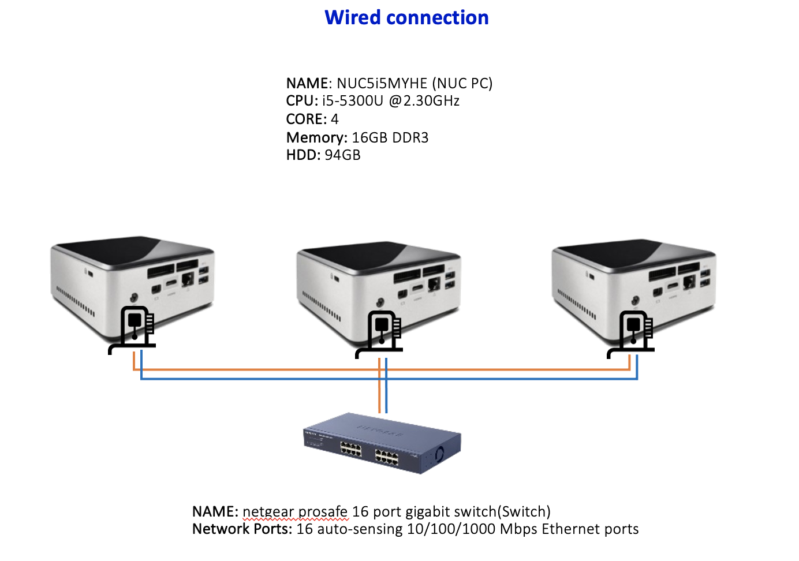

### 2-1. 모든 NUC에서 다음의 작업 수행

#### 2-1-1. hostname 설정

`sudo hostname <name>`은 해당 명령어를 입력하는 노드(머신)의 hostname을 임시로 <name>으로 지정합니다. 다만 해당 설정은 현재 로그인된 세션에서만 적용되기 때문에, 새로운 터미널을 열거나 노드를 reboot할 경우에는 기존 hostname으로 돌아가게 됩니다. 이번 Lab에서는 쿠버네티스 클러스터 구성 편의를 위해, 각 NUC에 설정된 hostname을 변경합니다.

\*조교의 안내를 받아 nuc01, nuc02, nuc03의 역할을 부여 받으시기 바랍니다.

##### hostname 임시 변경

```shell
# At NUC 1 :
sudo hostname nuc01
# At NUC 2 :
sudo hostname nuc02
# At NUC 3 :
sudo hostname nuc03
```

##### 임시 변경된 hostname 확인

```shell
# 역할에 따라 nuc01, nuc02, 또는 nuc03 값이 출력되면 정상
hostname
```

`/etc/hostname`은 시스템이 부팅될 때 사용할 hostname을 저장하는 파일입니다. `echo <hostname>`을 사용하여 새로운 hostname이 `/etc/hostname` 파일에 기록하면, 재부팅 이후에도 변경된 hostname이 유지됩니다. 하지만 `/etc/hostname`을 변경했다고 해서 현재 세션에서 바로 적용되는 것은 아닙니다. 변경 사항을 즉시 적용하려면 추가적으로 `sudo hostname <name>` 명령어를 실행해야합니다. (하지만 우리는 바로 직전에 해당 명령어를 실행했으니 괜찮습니다.)

```shell
sudo rm /etc/hostname
hostname | sudo tee /etc/hostname
```

> 보충 설명) `hostname`의 출력값이 pipe(`|`)를 통해 `/etc/hostname` 파일로 전달됩니다.

#### 2-1-2. hosts IP 정보 등록

각 노드에서 nuc01, nuc02, nuc03에 해당하는 hosts의 IP 정보를 등록합니다. 모든 NUC에서 다음의 작업을 수행합니다.

`/etc/hosts` 파일 진입

```shell
sudo vi /etc/hosts
```

다음의 context를 붙여넣고 저장합니다.

```text
 <IP Address of NUC 1>  nuc01
 <IP Address of NUC 2>  nuc02
 <IP Address of NUC 3>  nuc03
```

#### 2-1-3. Connectivity 확인

각 노드에서 다른 노드로 연결이 잘 이루어지는지 ping을 사용해 확인합니다.

> **`ping`이란?** ping은 네트워크에서 특정 호스트가 정상적으로 연결되어 있는지 확인하는 명령어입니다. 대상 호스트로 ICMP Echo Request 패킷을 전송하고, 해당 호스트가 ICMP Echo Reply를 반환하면 연결이 정상적으로 이루어졌음을 의미합니다. 이를 통해 네트워크 연결 상태, 응답 시간(RTT), 패킷 손실 여부 등을 확인할 수 있습니다.

```shell
# At NUC 1
ping nuc02
ping nuc03

# At NUC 2
ping nuc01
ping nuc03

# At NUC 3
ping nuc01
ping nuc02
```

#### 2-1-4. 원격 접속 세팅

각 노드에서 다음의 명령어를 실행합니다. 다른 노드에서 해당 노드로 원격 접속을 가능하게 하기 위한 패키지입니다.

```shell
sudo apt install -y openssh-server
```

#### 2-1-5. containerd 설정

```bash
# For All NUCs
sudo apt-get update
sudo mkdir -p /etc/containerd
containerd config default | sudo tee /etc/containerd/config.toml
sudo sed -i 's/SystemdCgroup = false/SystemdCgroup = true/' /etc/containerd/config.toml
```

#### 2-1-6. At NUC1

**(추가) 화면 세팅 어떻게 하는 걸 추천하는 지 추가하기**

NUC1에서 다음의 명령어를 실행하여, NUC2와 NUC3에 원격 접속이 정상적으로 이뤄지는지 확인합니다.

\*컴시이실 실습의 경우 <nuc username>은 gist로 통일되어 있습니다.

```shell
# In new terminal
# e.g. ssh gist@nuc02
ssh <nuc2 username>@nuc02

# In another new terminal
# e.g. ssh gist@nuc03
ssh <nuc3 username>@nuc03
```

#### 2-1-7. NUC 재부팅

```shell
# For All NUCs
sudo reboot
```

# 지금부터 NUC1 학생 자리에서 모든 작업을 시작합니다. NUC2, NUC3 학생은 NUC1자리로 가서 함께 작업을 진행합니다.

### 2-2. Preparations for Clustering

```shell
# From All NUCs
docker version
```

## At NUC1

NUC1에서 NUC2와 NUC3에 원격 접속합니다.

```shell
# 새로운 터미털에서
ssh <NUC2 username>@nuc02

# 새로운 터미털에서
ssh <NUC3 username>@nuc03
```

> ### 화면 세팅 Tip
>
> 각 원격 접속마다 별도의 터미널 **창**을 띄우게 되면 조작이 번거롭습니다. 다음의 사진과 같이 3개의 터미널 **탭**을 띄우고, 2번째와 3번째 탭에는 각각 NUC2와 NUC3에 원격 접속하도록 합니다.
> 새로운 터미널 탭을 띄우는 단축키는 `Ctrl + Shift + T`입니다.
> 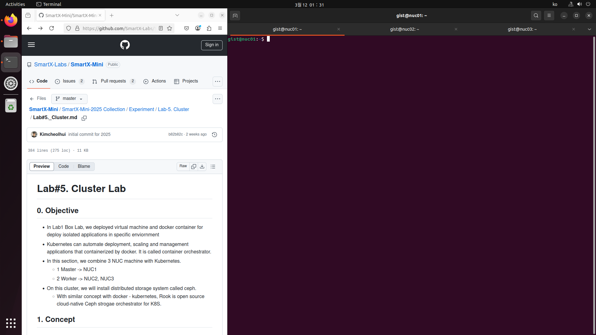

### 2-3. 쿠버네티스 설치(For All NUCs)


- NUC 1 : Master
- NUC 2 : Worker 1
- NUC 3 : Worker 2

#### 2-3-1. Swapoff

<b>스왑 메모리(Swap Memory)</b>는 물리적 RAM이 부족할 때, 디스크 공간의 일부를 가상 메모리처럼 사용하는 기능입니다. 하지만 Kubernetes는 노드의 메모리 사용량을 정확히 파악하고 스케줄링해야 하기 때문에, 스왑을 사용하면 예측 불가능한 성능 문제가 발생할 수 있습니다. 특히, 컨테이너의 메모리 제한이 제대로 적용되지 않거나, 스왑으로 인해 응답 속도가 느려지는 문제가 발생할 수 있어, 안정적인 클러스터 운영을 위해 Kubernetes에서는 스왑을 비활성화해야 합니다.

```shell
# From All NUCs
sudo swapoff -a
```

#### 2-3-2. Install Kubernetes

> **주의)** 각각의 실행이 정상적으로 이뤄지는지 확인하면서 진행할 것

```shell
# At All NUCs
sudo apt-get update && sudo apt-get install -y apt-transport-https curl ipvsadm wget

curl -fsSL https://pkgs.k8s.io/core:/stable:/v1.28/deb/Release.key | sudo gpg --dearmor -o /etc/apt/keyrings/kubernetes-apt-keyring.gpg

echo 'deb [signed-by=/etc/apt/keyrings/kubernetes-apt-keyring.gpg] https://pkgs.k8s.io/core:/stable:/v1.28/deb/ /' | sudo tee /etc/apt/sources.list.d/kubernetes.list

sudo apt update

sudo apt install -y kubeadm=1.28.1-1.1 kubelet=1.28.1-1.1 kubectl=1.28.1-1.1
```

이로써 쿠버네티스 클러스터를 구성하기 위한 준비를 마쳤습니다.

### 2-4. Kubernetes Configuration

이제 쿠버네티스 클러스터를 실제로 구축하도록 하겠습니다.

#### 2-4-1. Kubernetes Master Setting(For NUC1)

```shell
# From NUC1
sudo kubeadm init --pod-network-cidr=10.244.0.0/16
```

> ⚠️ **만약 preflight 오류가 발생했다면 다음의 작업을 진행해주세요**
>
> 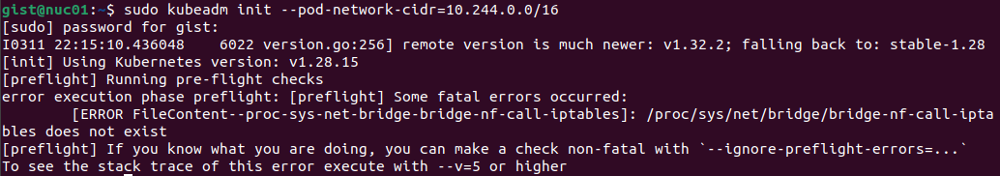
>
> **오류 원인**
>
> 해당 이슈는 bridge-nf-call-iptables kernel module이 누락되거나 로드되지 않았기 때문에 발생합니다. 쿠버네티스는 bridges traffic에 대한 iptables 규칙을 활성화하기위해 이 모듈이 필요하며, 이 모듈이 누락되면 kubeadm 초기화에 실패합니다.
>
> **해결 방법**
>
> ```shell
> # br_netfilter kernel module load하기
> sudo modeprobe br_netfilter
> # 아래 명령어로 br_netfilter가 잘 loaded된 것을 확인했으면
> lsmod | grep br_netfilter
> # kubeadm을 다시 한 번 실행
> kubeadm init --pod-network-cidr=10.244.0.0/16
> ```

kubeadm 명령어가 정상적으로 실행됐다면, 아래 사진과 같이 쿠버네티스 클러스터에 Join할 수 있는 토큰을 포함한 명령어가 생성됩니다. 해당 명령어를 별도의 텍스트 파일로 저장하거나, 사라지지 않도록 해주시기 바랍니다.

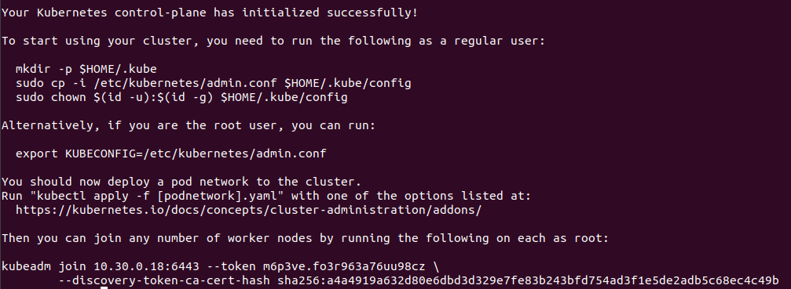

NUC1에서 다음의 명령어를 실행합니다.

```shell
# At NUC1
rm -r $HOME/.kube
mkdir -p $HOME/.kube
sudo cp -i /etc/kubernetes/admin.conf $HOME/.kube/config
sudo chown $(id -u):$(id -g) $HOME/.kube/config
# master node도 woreker node처럼 Pod를 배포할 수 있게 해주는 명령어입니다. 이번 실습에서는 입력하지 않아도 됩니다.
# kubectl taint nodes --all node-role.kubernetes.io/master-
```

#### 2-4-2. Kubernetes Worker Setting(For NUC2, NUC3) [쿠버네티스 클러스터 reset시 사용하며, 최초 진행 시에는 사용하지 않아도 됩니다!]

```shell
# From NUC2, NUC3
# sudo kubeadm reset -f
# sudo rm -r /etc/cni/net.d
# sudo ipvsadm --clear
```

#### 2-4-3. Worker Join

이제 Worker Nodes를 쿠버네티스 클러스터에 Join합니다.

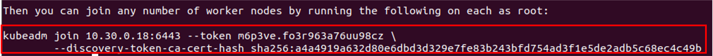

```shell
# 빨간 칸 안에 있는 명령어를 복사하고, 앞에 `sudo`를 붙여 NUC2와 NUC3에 입력합니다.
# (에러) preflight 에러 발생 시, --ignore-preflight-errors=all 맨 뒤에 붙여서 다시 입력합니다.
```

#### 2-4-4. Check Nodes at NUC1

```shell
# At NUC1
kubectl get node
```

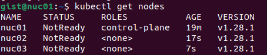

위 사진에서 nuc02와 nuc03이 NotReady 상태인 이유는 네트워크 플러그인(CNI)이 아직 설치되지 않았거나, 워커 노드가 마스터 노드에 정상적으로 조인되지 않았기 때문입니다. Kubernetes에서는 클러스터 내 네트워크가 설정되지 않으면 노드를 Ready 상태로 만들지 않으며, kubeadm join이 제대로 실행되지 않은 경우에도 NotReady 상태가 유지됩니다. 이를 해결하려면 CNI를 설치하고, 워커 노드가 정상적으로 조인되었는지 확인해야 합니다. 바로 이어지는 section에서 CNI를 설치해보겠습니다.

### 2-5. Kubenetes Network Plugin Installation

#### CNI란?

<b>CNI(Container Network Interface)</b>는 쿠버네티스 클러스터에서 컨테이너 간 네트워크를 설정하고 관리하는 표준 인터페이스입니다. 쿠버네티스는 기본적으로 네트워크 기능을 자체적으로 제공하지 않으며, CNI 플러그인을 사용해 각 `Pod`들이 서로 통신할 수 있도록 합니다.

#### Flannel이란?

`Flannel`은 쿠버네티스에서 가장 많이 사용되는 CNI 플러그인 중 하나로, 간단한 네트워크 오버레이(overlay)를 제공하여 Pod간 통신을 가능하게 해줍니다. Flannel은 노드 간 네트워크를 VXLAN, Host-GW 등의 방식으로 구현하며, 다른 복잡한 네트워크 정책 관리 기능은 제공하지 않고 기본적인 Pod-to-Pod 통신을 보장하는 역할을 합니다. Flannel 외에도 Calico, Cilium, Weave 같은 다른 CNI 플러그인도 많이 사용됩니다.

```shell
# At NUC1
kubectl apply -f https://github.com/flannel-io/flannel/releases/latest/download/kube-flannel.yml
```

```shell
# At NUC1 -> 노드 상태 확인
kubectl get nodes
```

Flannel CNI 설치 후 약간의 시간이 지나고 위 명령어를 입력하면, 아래와 같이 각 worker node의 status가 Ready로 변경된 것을 확인할 수 있습니다.

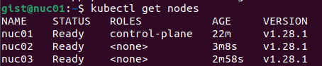

```shell
# At NUC1 -> kube-system 네임스페이스의 모든 Pod 확인
kubectl get po -n kube-system -o wide
```

> **명령어 보충 설명**
>
> `kubectl get po -n kube-system -o wide`
>
> `kubectl get po` → 현재 클러스터에서 실행 중인 `Pod` 목록을 조회
>
> `-n kube-system` → 쿠버네티스 내부 시스템 Pod가 실행되는 `kube-system` 네임스페이스에서만 조회
>
> `-o wide` → Pod의 추가 정보(IP, 노드 위치 등)를 포함하여 출력
>
> 이 명령어를 실행하면 Flannel을 포함한 쿠버네티스 내부 관리용 Pod(Nodes Controller, DNS, Scheduler 등)의 상태를 확인할 수 있습니다.
>
> 더 자세한 내용은 공식 [Kubernetes 문서](https://kubernetes.io/ko/docs/concepts/overview/components/)에서 확인할 수 있으며, 이번 실습에서는 자세히 다루지 않습니다.


이로써 쿠버네티스 클러스터의 네트워크 구성이 완료되었습니다. Flannel을 통해 Pod 간 네트워크 통신이 가능해졌으며, 이제 클러스터 내부에서 여러 애플리케이션을 배포할 수 있습니다.

### 3. kubernetes example

1. cd ~
2. mkdir k8s && cd k8s
3. vim simple-app.yml 하고 파일 복붙
4. kubectl apply -f simple-app.yml
5. kubectl get pod -o wide -> my-simple-app 파드 확인 + Pod IP 확인
6. 해당 Pod IP:5000으로 웹사이트에서 확인해보기
7. kubectl delete -f simple-app.yml
8. kubectl get pods -> pod 삭제된 것 확인 -> 브라우저 접속 안되는 거 확인
9. 이제 deploymeyt 작성 및 실행
10. kubectl get pods 확인 -> 각 pod의 ip:5000로 직접 들어가보기 -> 값이 다른 것 확인
11. service 작성 및 실행 및 kubectl svc로 Cluster IP 확인
12. Cluster IP:80 (80은 없어도 됨) 브라우저 방문해서 값 달라지는 거 확인
13. Pod 개수 들리기 -> Deployment 수정 -> Pod 확인
14. 아까 그 웹사이트 방문해서 새로고침 연타 -> 새로운 Pod 반영 확인
15. 이제 rolling update 확인

- kubectl set image deployment/simple-app-deployment simple-app=cheolhuikim/my-simple-app:v2
- kubectl rollout status deployment/simple-app-deployment
  - rollout 상태 확인
- kubectl get pods
  - 현재 pod 상태 보면 Terminating 중인 게 좀 있을거임.

16. 웹사이트 방문 -> 새로고침 -> version 2로 변경됨
17. 버전 업데이트 rollback

- oh no!! 우리 서비스에 치명적인 오류가 있었어요! 빠르게 이전 버전으로 되돌려 봅시다.
- kubectl rollout undo deployment/simple-app-deployment

끝!

# 3. Review

<lab 요약>

<why this lab?>

<lab 전체 과정 요약>
