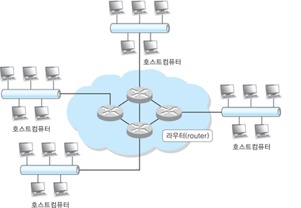

# Appendix: Evolution of Networks and the Concept of Gateways

## Table of Contents

1. [Overview of Network Evolution](#1-overview-of-network-evolution)
2. [What Are IP and Port in a Network?](#2-what-are-ip-and-port-in-a-network)
3. [What Is a Gateway?](#3-what-is-a-gateway)
4. [The Relationship Between IP, Port, and Gateway](#4-the-relationship-between-ip-port-and-gateway)
5. [Practice: Gateway and Network Testing](#5-practice-gateway-and-network-testing)

## 1. Overview of Network Evolution

### What Is a Network?

Humans communicate through sound. Computers, on the other hand, exchange data through electrical or wireless signals.  
This structure for exchanging information is what we call a **"network."**

In the early days, two computers were connected via a single wire to send data. As more computers needed to connect, more efficient and scalable network structures were developed.

Today, nearly all computers are connected to some type of network, enabling web browsing, file sharing, remote access, and more.

#### Example of a Modern Network

The following image illustrates a typical modern network setup:



### History and Key Concepts in Networking

The development of networks over time has led to the internet as we know it today:

| Era       | Key Technology             | Description                                                  |
| --------- | -------------------------- | ------------------------------------------------------------ |
| 1960s     | Circuit Switching          | Based on telephone lines; dedicated connection between nodes |
| 1970s     | Packet Switching           | Data divided into packets for efficient transmission         |
| 1980s     | LAN & TCP/IP Adoption      | Expansion of private networks; TCP/IP protocol introduced    |
| 1990s     | Internet Commercialization | ISPs emerged; public/private IP distinctions established     |
| 2000s–Now | Optical Comm, IPv6         | High-speed networking; expanded IP range                     |
|           |                            |                                                              |

### Essential Terms to Know

- **Circuit**: A physical communication path between devices
- **Packet**: A small chunk of data used for transmission
- **Protocol**: A set of rules for communication (e.g., TCP/IP)
- **LAN**: Local network (e.g., home, office)
- **ISP (Internet Service Provider)**: Company that provides internet access
- **Optical Communication**: Fast data transfer using light
- **Router**: Device that determines where to send data
- **BGP (Border Gateway Protocol)**: Manages routes between large networks

## 2. What Are IP and Port in a Network?

### Why Do We Need IP Addresses and Ports?

To communicate over the internet, devices need an **address** and a **doorway**.  
These are the **IP Address** and **Port Number**, respectively.

- **IP Address**: Identifies a device in a network (e.g., 192.168.1.1)
- **Port**: Specifies which application or service to connect to on a device (e.g., 80, 443)

> [!note]
>
> The meaning of IP and Port may vary slightly when used in personal devices versus network infrastructures. This section uses a PC context for clarity.

### Role and Examples of Ports

Ports allow multiple programs to use the network simultaneously.  
For example, web browsers use port 80 (HTTP) and 443 (HTTPS).

| Port | Service | Description                     |
| ---- | ------- | ------------------------------- |
| 80   | HTTP    | Unencrypted web traffic         |
| 443  | HTTPS   | Encrypted web traffic (SSL/TLS) |
| 22   | SSH     | Secure terminal access          |
| 3389 | RDP     | Remote desktop (Windows)        |
|      |         |                                 |

### DNS and IP Address


While computers use numerical IP addresses, humans prefer to use **domain names** (e.g., google.com).  
The **Domain Name System (DNS)** translates domain names into IP addresses.

- User types a domain
- DNS server returns the corresponding IP
- Browser connects using the IP

Domains must be registered and made known to global DNS servers to work properly.

### NAT(Network Address Translation) and Port Forwarding

In many cases, one public IP is shared by multiple devices.  
This is made possible through **NAT (Network Address Translation)** and **Port Forwarding**.

- **NAT**: Translates private IPs to a public IP for internet communication
- **Port Forwarding**: Routes external requests to a specific device inside the network
- Example: `PublicIP:8080` → `192.168.1.100:80` (web server inside local network)

### Key Checkpoint


For successful network communication, two things are required:

1. The destination device's **IP address**
2. The **port number** where the target service is running

The operating system routes incoming requests based on port numbers to the correct application.

- Domains like `google.com` also use ports.
- Ports 80 and 443 are commonly omitted because browsers add them automatically.

## 3. What Is a Gateway?

### Definition

A **Gateway** connects different networks and acts as a bridge or checkpoint.  
Most commonly, it's the **link between a private network and the public internet.**


The blue node in the image is functioning as a router and gateway.  
The clouds represent physical distances (e.g., Korea ↔ USA or Seoul ↔ Busan).

### Main Functions of a Gateway

1. **Packet Forwarding**: Routes traffic between internal and external networks
2. **NAT Translation**: Converts private IPs to public IPs
3. **Security Management**: Applies firewalls and controls port access
4. **Routing**: Determines optimal path for data delivery

> Routing is like GPS for data: It helps find the best path when all you know is the IP address.

### Types of Gateways

| Type                    | Description                                                        |
| ----------------------- | ------------------------------------------------------------------ |
| **Default Gateway**     | Basic route to access the internet from a personal device          |
| **Router Gateway**      | Home/office router connecting private devices to ISP               |
| **ISP Gateway**         | Operated by service providers; routes user traffic to the internet |
| **Application Gateway** | Proxies, firewalls that manage traffic at the application level    |
|                         |                                                                    |

## 4. The Relationship Between IP, Port, and Gateway

These three elements — **IP address**, **port**, and **gateway** — are essential for network communication.

### What Is an IP Address?

IP addresses identify devices on a network.

- **Public IP**: Globally unique, used for internet access (e.g., 8.8.8.8)
- **Private IP**: Used inside local networks (e.g., 192.168.1.x)

> [!note]
>
> Private IPs cannot access the internet directly. Gateways perform NAT to bridge the gap.

### What Is a Port?

A port is a number that determines <b>which programs (services)</b> within a device (IP) communicate with each other.

- If an IP is an “address”, a port is like a “room number”.
- Because multiple programs can be running at the same time, ports are used to differentiate between them to forward requests.

| Port | Service | Description                |
| ---- | ------- | -------------------------- |
| 80   | HTTP    | Web (non-secure)           |
| 443  | HTTPS   | Web (secure)               |
| 22   | SSH     | Secure terminal connection |
| 3389 | RDP     | Remote Desktop Protocol    |
|      |         |                            |

### What Does a Gateway Do?

A gateway is the connection point between your internal network and the external network (the Internet).

- Internal devices usually only have private IPs, so they can't access the internet directly.
- A gateway communicates with the internet on their behalf, **translating (NAT)** between private and public IPs.
- You also need to set up port forwarding to forward incoming requests from the outside to a specific device.

> For example, incoming traffic to `PublicIP:8080` can be forwarded to `192.168.1.100:80`.

### Summary of Communication Flow

1. User enters `google.com`
2. DNS returns the IP address (e.g., 142.250.206.14)
3. Browser sends request to the IP via the default gateway
4. Gateway sends it out using the public IP
5. Response comes back and is routed to the correct local device

### Why Are These Three Important?

- **IP**: Determines the destination
- **Port**: Determines which service to contact
- **Gateway**: Provides access to the internet

All three of these must be set correctly for network communication to work properly.

## 5. Practice: Gateway and Network Testing

Try these commands to apply the concepts:

### (1) Check Default Gateway

```bash
ip route
```

Example Output:

```bash
default via 192.168.1.1 dev eth0 proto dhcp metric 100
```

- The IP address after default via is your default gateway.
- Your computer uses this to access external networks (e.g., the internet).

### (2) Gateway Connection Test (Ping)

```bash
ping 192.168.1.1
```

Example Output:

```bash
64 bytes from 192.168.1.1: icmp_seq=1 ttl=64 time=1.23 ms
```

- `ping` checks whether a network device is reachable.
- A successful response means the device is online and reachable.

### (3) Check Your Public IP

```bash
curl ifconfig.me
```

Example Output:

```bash
203.0.113.45
```

- This is your public IP address visible to the internet.
- If you're behind a router with NAT, all local devices share this public IP.

### (4) Check if a port is open

```bash
nc -zv 192.168.1.1 80
```

Example Output:

```bash
Connection to 192.168.1.1 80 port [tcp/http] succeeded!
```

- The nc (netcat) command checks whether a specific port on a device is open.
- If successful, the service (e.g., web server) is listening on that port.

### (5) Test Port with Python

```python
import socket

def check_port(ip, port):
    with socket.socket(socket.AF_INET, socket.SOCK_STREAM) as s:
        s.settimeout(1)
        result = s.connect_ex((ip, port))
        if result == 0:
            return f"Port {port} is open on {ip}"
        else:
            return f"Port {port} is closed on {ip}"

print(check_port("192.168.1.1", 80))
```

- This script checks programmatically whether a given port on a target IP is open
- Useful when checking multiple ports or automating tests.

### Practice Summary

| Check Item              | Command/Method     |
| ----------------------- | ------------------ |
| Default Gateway         | ip route           |
| Test Gateway Connection | ping               |
| Public IP               | curl ifconfig.me   |
| Port Status             | nc -zv [ip] [port] |
| Programmatic Check      | Python 소켓 사용   |
|                         |                    |
