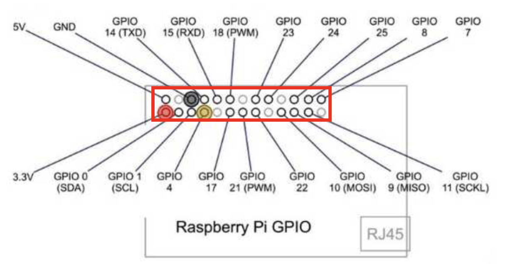
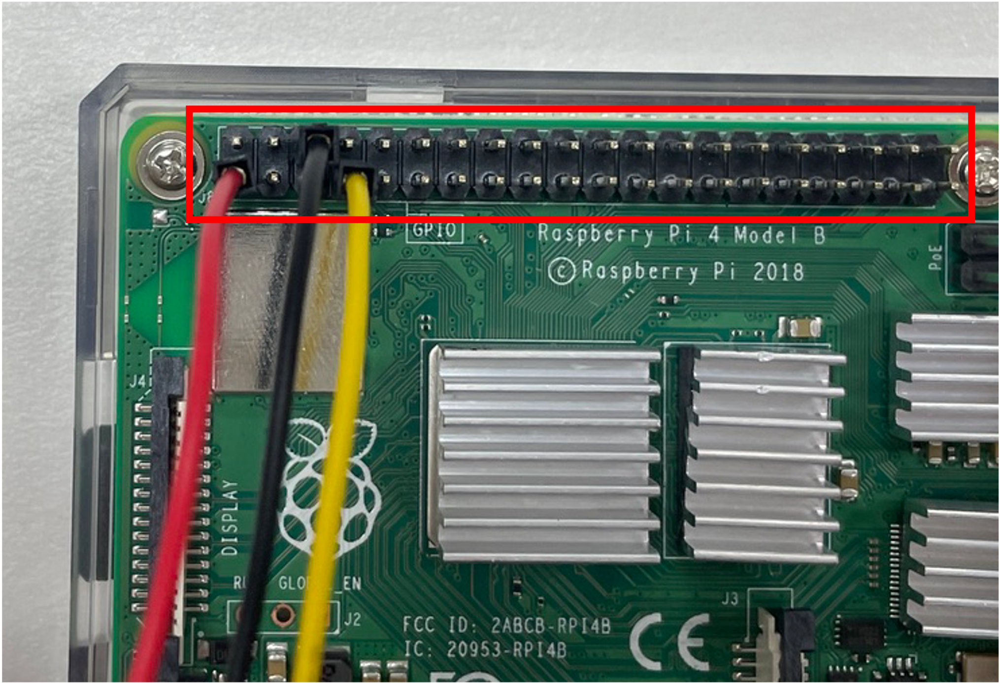
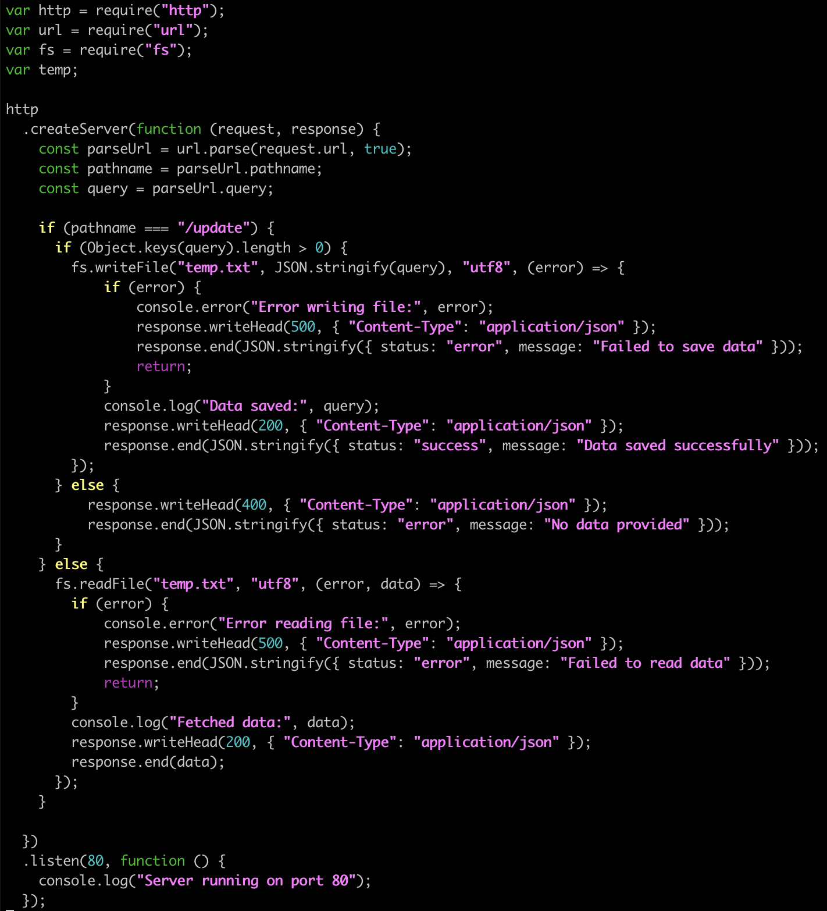
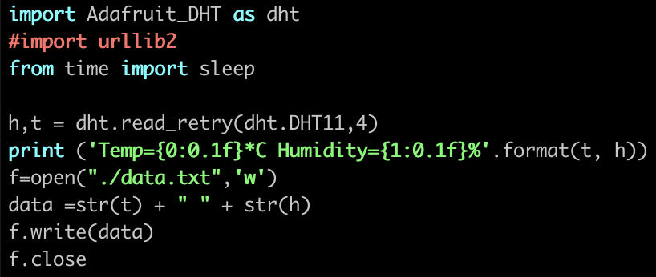
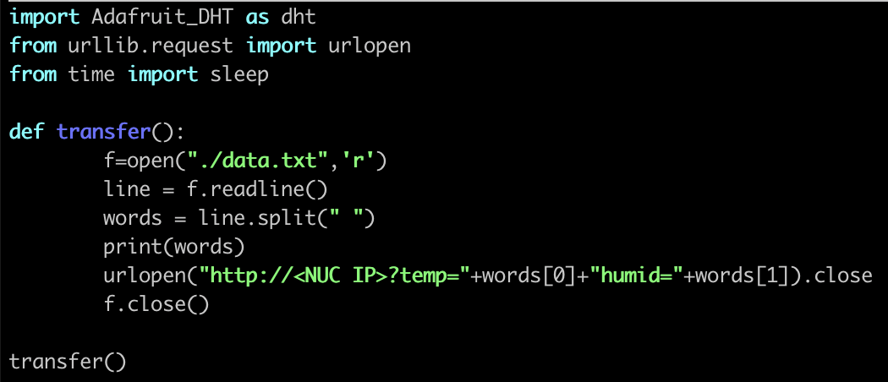

# Lab#3. IoT Lab

# 0. Objective


**The goal of this Lab is to build an IoT-Cloud Hub that collects data using IoT sensors and transmits it to a server.**

## 0-1. Lab Goal

- Collect IoT sensor data using Raspberry Pi
- Transmit sensor data to a cloud server
- Visualize real-time data through a Node.js-based web server

In this Lab, you will collect sensor data using Raspberry Pi with physical sensor and practice processing and simple visualizing it on a NUC server.

## 0-2. Why is the IoT-Cloud System Necessary?

Data collected from IoT devices may not be meaningful individually, but when integrated and analyzed in the cloud, it can provide powerful information or insights. Such data is utilized in various fields such as real-time monitoring, automation, and remote control. The monitoring system built in Lab 4 - Tower Lab has similar needs, and this Lab can be seen as a monitoring system using IoT.

For example:

- **Smart Farms**: Soil humidity sensors placed in greenhouses send data to the cloud in real time. Based on this data, the system automatically controls water supply, optimizing crop growth while saving resources.
- **Smart Buildings**: Temperature and motion sensors detect occupancy in office spaces. The building management system uses this data to adjust lighting and HVAC (Heating, Ventilation, Air Conditioning) systems, reducing energy consumption and improving comfort.

## 0-3. Node.js

Node.js is an open-source, cross-platform backend JavaScript runtime environment that runs on the V8 engine and can execute JavaScript code outside of a web browser. With Node.js, developers can write command line tools in JavaScript or execute server-side scripts to dynamically generate content before the web page is sent to the user. As a result, Node.js realizes the "JavaScript everywhere" paradigm, allowing web applications to be developed in a single programming language (JavaScript) without the need for different languages on the server and client sides. In this Lab, Node.js is used to store IoT sensor data and provide simple visualization.

## 0-4. Adafruit_python_DHT

To easily use the temperature-humidity sensor, we use Adafruit_python_DHT. Adafruit_python_DHT is a Python library provided by Adafruit that supports the use of temperature-humidity sensors such as DHT11, DHT22, and AM2302 on SBCs (Single Board Computers) like Raspberry Pi and BeagleBone. This library provides functionality to read and process sensor data, and allows temperature and humidity to be measured with simple Python code.

# 1. Preparation



The above image shows the **GPIO (General Purpose Input/Output) pin layout** of the Raspberry Pi. GPIO pins allow the Raspberry Pi to send and receive electrical signals by connecting to external devices. In simple terms, they are multipurpose pins that can be used to connect sensors, LEDs, motors, and more for input or output.

- Red pin (3.3V power): This pin outputs 3.3V power and is used to provide a stable voltage to low-power sensors and other peripherals.
- Yellow pin (GPIO4): A general-purpose GPIO pin that can perform various input and output roles.
- Black pin (GND): Acts as the return path (reference point) for electric current. When connecting sensors or LEDs, it is always needed along with power (in this case, 3.3V).

> [!important]
>
> **Now, connect the temperature-humidity sensor to the Raspberry Pi as shown in the red box in the photo above. See below for real pictures!**




---

# 2. Practice

## 2-1. Running a Node.js Web Server in Docker Container ( in NUC )

### 2-1-1. Run Docker Container

Run the prepared Docker container image below.

```bash
sudo docker run -it --net host --dns 203.237.32.100 --name webserver cheolhuikim/smartx-box-mini
```

Once you get inside the container, run the following commands.

```bash
apt-get update

apt-get install vim
```

## 2-2. Modify Web Server Code ( in NUC )

Run the following command to check the web server code. (No modification is needed.)

This web server performs the following functions depending on the path of the request:

1. Receives values to update information
2. Returns stored information in JSON format

```bash
vim /SmartX-Mini/IoT-labs/webserver.js
```



## 2-3. Test Temperature-Humidity Sensor ( in PI )

Now, let's verify that the temperature-humidity sensor connected to the Raspberry Pi is working correctly.

### 2-3-1. Install package

Enter the following commands to download the necessary files:

```bash
cd ~
git clone https://github.com/adafruit/Adafruit_python_DHT.git
```

> **Adafruit_python_DHT?** Refer to `0-4. Adafruit_python_DHT`

We need to modify the Adafruit_DHT package installer so that Raspberry Pi version 4 is recognized as version 3.

> [!note] Why?
>
> The SoC (System on Chip) of Raspberry Pi 4 is `BCM2711`, but the existing Adafruit_python_DHT library does not recognize it and treats it differently than the supported BCM2835, BCM2837, etc. Therefore, modifying the platform_detect.py file to recognize `BCM2711` as Pi 3 allows the library to function correctly and read sensor data without compatibility issues.

First, open the file:

```bash
cd ~/Adafruit_python_DHT

sudo vim Adafruit_DHT/platform_detect.py
```

Add a case for **BCM2711** in the `pi_version` function to return 3.

```python
def pi_version():
    …
    elif match.group(1) == 'BCM2835':
        # Pi 3 or Pi 4
        return 3
    elif match.group(1) == 'BCM2837':
        # Pi 3b+
        return 3
    elif match.group(1) == 'BCM2711': # added
        # Pi 4b
        return 3                      # added
    else:
        # Something else, not a pi.
        return None

```

Now that we've modified the package installer, install the necessary packages. This may take some time.

```bash
sudo apt-get update

sudo apt-get install -y python3-pip

sudo python3 -m pip install --upgrade pip setuptools wheel

sudo apt install -y build-essential python3-dev

sudo pip3 install .
```

<details>
<summary>Package Versions (Expand)</summary>

#### PI

|     Package     |   Version   |
| :-------------: | :---------: |
|   python3-pip   | 18.1-5+rpt1 |
| build-essential |    12.6     |
|   python3-dev   |   3.7.3-1   |

#### Python

|  Package   |   Version   |
| :--------: | :---------: |
| setuptools |  40.8.0-1   |
|   wheel    | 18.1-5+rpt1 |

</details>
<br>

### Test Temperature-Humidity Sensor ( in PI )

Navigate to the example folder.

```bash
cd ~/Adafruit_python_DHT/examples
```

Open the test code and change `python` to `python3`.

```bash
sudo vim AdafruitDHT.py
```

From

```python
#!/usr/bin/python
...

```

To

```python
#!/usr/bin/python3
...

```

Run the test code.

```bash
sudo ./AdafruitDHT.py 11 4
```

If temperature and humidity are displayed correctly as shown below, the sensor is properly connected to the Raspberry Pi. If an error occurs, follow these steps:

1. Go back to `1. Preparation` and check if the sensor's pins are correctly inserted into the GPIO pins.
2. If no problem is found, **check whether the packages were installed properly**. Reinstalling the package might help.
3. The sensor might be broken. If the issue still isn't resolved, call the TA.


## 2-4. Collect and Transmit Sensor Data ( in PI )

Now, let's modify the relevant code to transmit sensor data collected on the Raspberry Pi to the NUC.

### 2-4-1. Install required packages

```bash
sudo apt-get update

sudo apt-get install -y python3-numpy

sudo apt-get install -y mercurial
```

<details>
<summary>Package Versions (Expand)</summary>

#### PI

|    Package    |     Version     |
| :-----------: | :-------------: |
| python3-numpy |   1:1.16.2-1    |
|   mercurial   | 4.8.2-1+deb10u1 |

</details>
<br>

### 2-4-2. Sensor Data Collection Code

Run the following command to check the sensor data transmission code. (No modification is needed.)

**This code runs on the Raspberry Pi and reads data from the sensor to save in a file.**

```bash
vim ~/SmartX-mini/IoT-labs/RPI_capture.py
```



### 2-4-3. Sensor Data Transmission Code

Open the code that sends the saved sensor data and modify `<NUC IP>` to your NUC IP.

```bash
vim ~/SmartX-mini/IoT-labs/RPI_transfer.py
```



## 2-5. Run IoT Web Service

Now, let's run a simple IoT Web Service based on the work done so far.

### 2-5-1. Run Web Server ( in NUC )

Run the following command inside the Docker container running on the NUC. This command runs the web server code named `webserver.js`.

```bash
cd /SmartX-Mini/IoT-labs

nodejs webserver.js
```

### 2-5-2. Collect and Transmit Sensor Data ( in PI )

Run the following commands. `process.sh` repeatedly runs the `RPI_capture.py` and `RPI_transfer.py` files we just reviewed.

```bash
cd ~/SmartX-mini/IoT-labs

# Grant execution permission
chmod +x process.sh

sudo ./process.sh
```

### 2-5-3. Access IoT Web Service ( in NUC )

Open a web browser on the NUC and go to `http://<NUC IP>`.

If you see the following screen, you're successful! Refresh the page to see the temperature-humidity sensor data changing continuously.


---

# 3. Lab Summary

The goal of this Lab is to build an IoT-Cloud Hub that collects data using IoT sensors and transmits it to a server. You practiced building an IoT-Cloud system that collects IoT sensor data using Raspberry Pi, sends it to a web server located on a NUC, and visualizes it.

## (Recall) Why is the IoT-Cloud System Necessary?

Data collected from IoT devices may not be meaningful individually, but when integrated and analyzed in the cloud, it can be powerfully utilized in real-time monitoring, automation, remote control, and other fields. In this Lab, you practiced the concept of IoT-based data monitoring by processing and visualizing IoT data on the web, similar to the monitoring system handled in Tower Lab.

## Summary of Key Steps

1. Connect and test the temperature-humidity sensor using Raspberry Pi GPIO pins
2. Transmit the temperature-humidity sensor data to the NUC server
3. Visualize data using a Node.js-based web server
