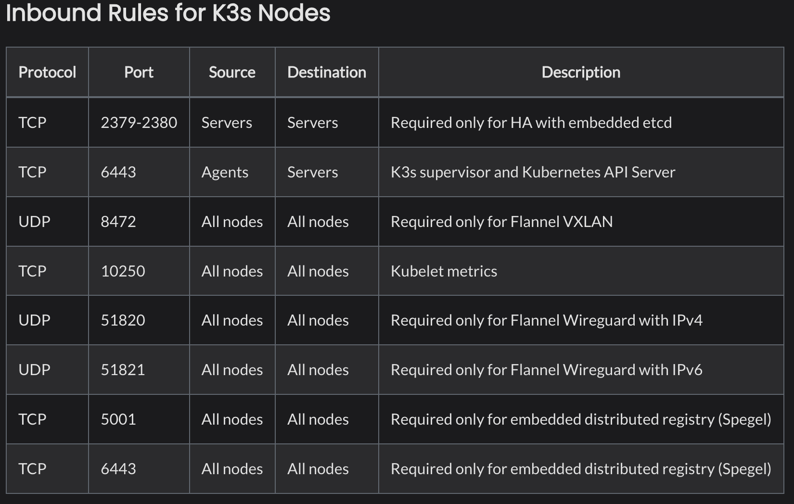

## (Optional) K3S installation

설치하기 전, docke, openssh-server, ssh, vim, tet-tools가 설치되어 있어야합니다.

### 1. To set firewall using ufw



모든 눅에 위 테이블 속 All nodes 에 해당하는 포트를 개방합니다.
Agents : 워커 노드가 될 눅
Servers : 마스터 노드가 될 눅

#### 1-1. port-forwarding

```shell
# How to use ufw
sudo ufw enable # ufw가 켜져 있는지 아닌지 확인 할 수 있습니다.
sudo ufw status # ufw의 상태가 inactivate 상태라면 해당 명령어를 통해 활성화 시켜줍니다.
sudo ufw allow {start}:{end}/tcp # to open tcp port method if, need to open 2379~2380 ports, ufw allow 2379:2380/tcp
sudo ufw allow 2380/udp # to open udp port method
# 위 방법으로 모두 세팅한 후, 다시 ufw status 를 통해 열려있는지 확인합니다.
```

#### 1-2. Master Node port-forwarding

```shell
# from Master mode(NUC1)
sudo ufw allow 2379:2380/tcp
```

#### 1-3. Worker Node port-forwarding

```shell
# from Master mode(NUC2, 3)
sudo ufw allow 6443/tcp
```

### 2. Install K3s (NUC1)

마스터 노드(NUC01)에서 실행하여 실질적인 마스터 노드로 만들어 줍니다.

```shell
# from Master mode(NUC1)
curl -sfL https://get.k3s.io | sh -
```

### 3. Join Worker Node.

#### 3-1. 마스터 노드에서 token 조회하기

```shell
# from Master mode(NUC1)
cat /var/lib/rancher/k3s/server/node-token
```

위 명령어로 얻은 토큰을 활용하여 NUC2, NUC3를 worker node로 join 합니다.

#### 3-2. 워커노드 조인

NUC2, NUC3에서 진행합니다.

```shell
# from Worker mode(NUC2.3)
curl -sfL https://get.k3s.io | K3S_URL=https://{nuc01_IP}:6443 K3S_TOKEN={token} sh -
```

#### 3-3. 노드 상태 확인 및 포드 확인

```shell
# from Master mode(NUC1)
kubectl get nodes
kubectl get pods --all-namespaces
```
